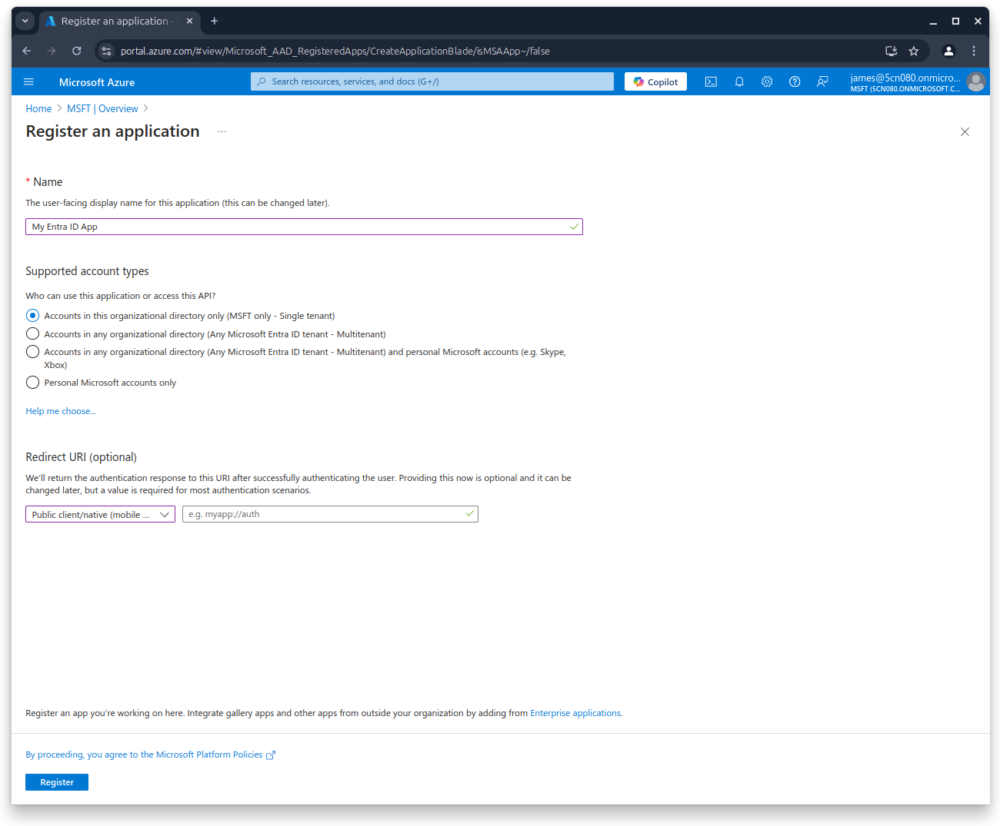
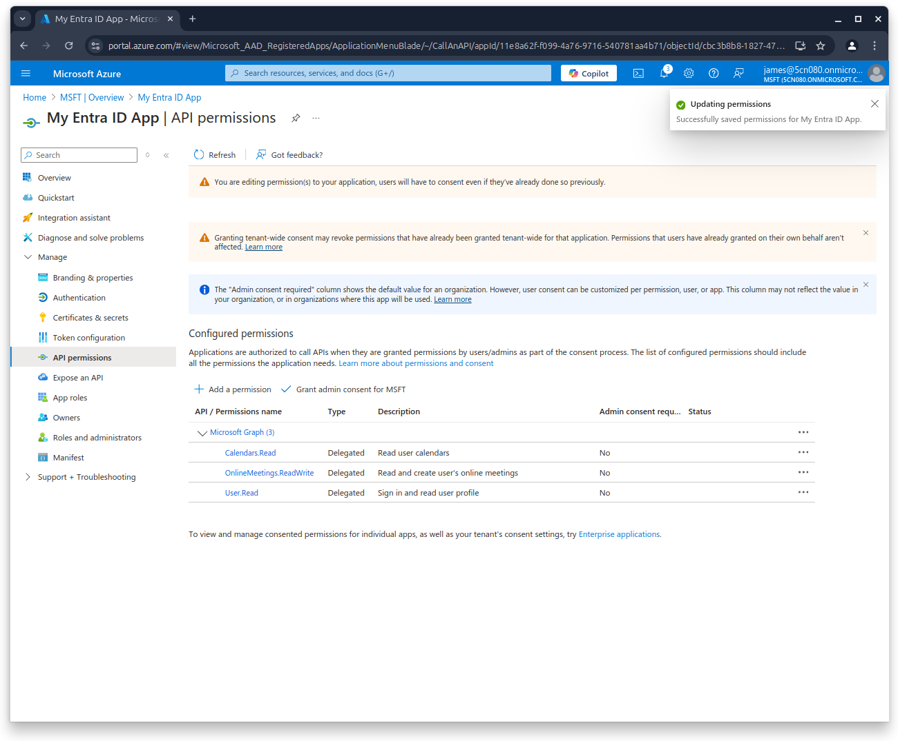
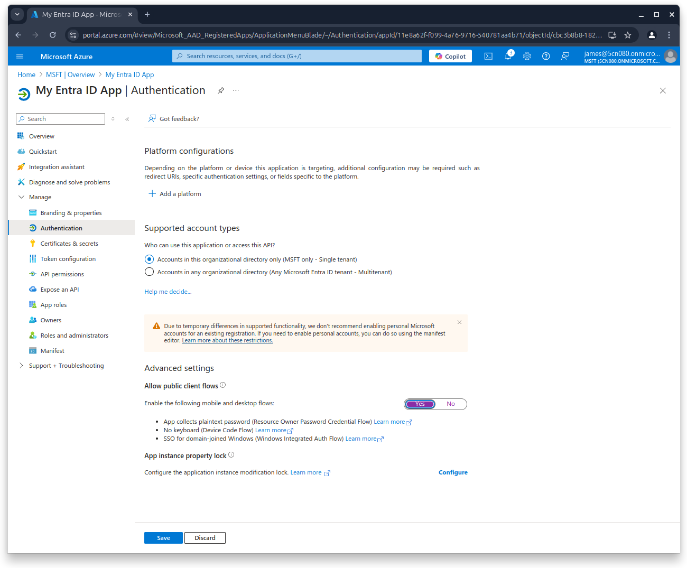
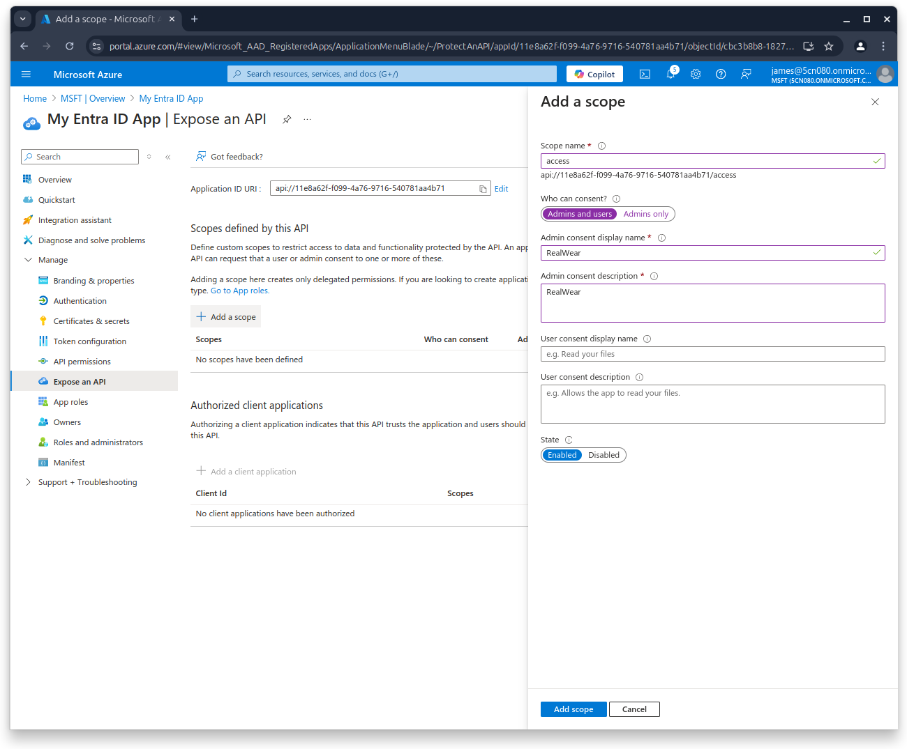

# Setting up Microsoft Azure Dependencies

RealWear Collaborate requires several Azure dependencies in order to operate.

- **Collaborate and AI Demos**
  - **EntraID Application** - enables secure user authentication and authorization, facilitating
    access to Azure services and integrated applications
  - **Managed Identity** - _(Optional)_ If hosting within Microsoft Azure, used for passwordless
    authentication to Azure services.
- **Collaborate**
  - **Azure Communication Services** - Used to generate access tokens for communication with
    Microsoft Teams
- **AI Demos**
  - **OpenAI Service** - GPT 3.5 and GPT 4o deployments
  - **Speech Services** - Provides dicatation and translation support

# Azure Entra ID Application Setup Guide

This guide provides step-by-step instructions to create an Azure Entra ID (formerly Azure Active
Directory) application and configure permissions for `User.Read`, `Calendar.Read`, and
`OnlineMeetings.ReadWrite`.

## Prerequisites

1. Access to an Azure account with permissions to create Entra ID applications.
2. Administrator privileges (if admin consent is required for permissions).

## Steps to Create an Azure Entra ID Application

### 1. Log in to the Azure Portal

1. Navigate to [Azure Portal](https://portal.azure.com).
2. Log in using your Azure account credentials.

### 2. Register an Application

1. Complete an App name - This will be viewable by the user when they sign-in
2. Choose the **Supported Account Type** - Single tenant is easiest for debugging, but does not
   allow users outside of your Microsoft tenant
3. If you are not working with the Teams Addon there is no need to provide a Redirect URI

### 3. Set the API Permissions

In order to access the user calendar, or for the addon user to connect to a device, some API
permissions should be setup.

1. Within the API Permissions, select **Add a permission**, **Microsoft Graph** and **Delegated
   permissions**
2. Search and select `Calendars.Read` and `OnlineMEetings.ReadWrite`

### 4. Enable Public Client Access

For **Device Code Flow** authentication (ie: 9-digit code login), the public cleint flows must be
enabled.

1. Within **Authentication**
2. Change the setting **Allow public client flows** to _Yes_ and hit save

### 5. Activate the Internal API

Exposing an API allows a logged-in user to access the internal NodeJS api and any special
functionality.

1. Navigate to **Expose an API**
2. Select **Add a scope**

- You may be asked for confirm a Application ID (the default is acceptable)

3. Fill in the scope details and select **Who can content - Admins and users**

- The rest of the fields can be filled in with any data, will not be viewed by suers

