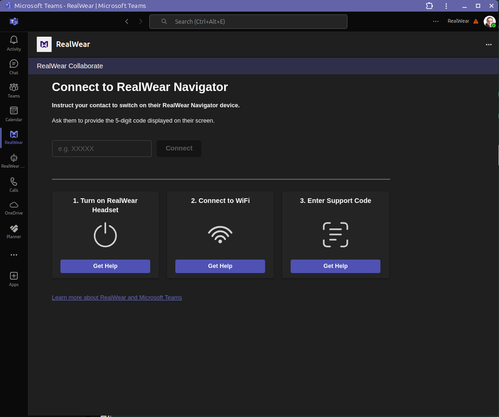
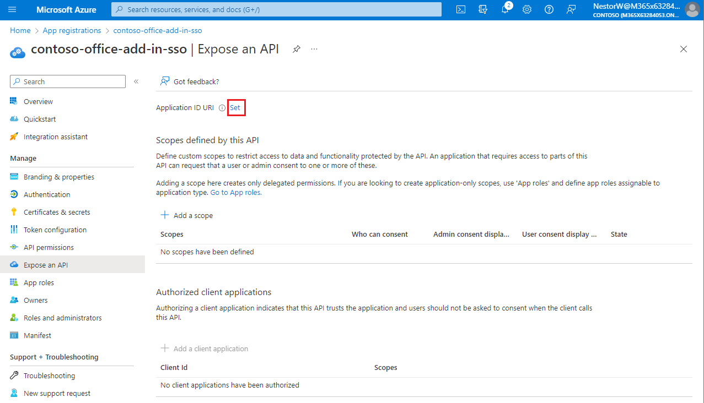

# Building the Microsoft Teams addon

RealWear Collaborate also launches with a Microsoft Teams addon (available in
[Microsoft App Source](https://appsource.microsoft.com/en-us/product/office/WA200007684?tab=Overview))
which is used for dialling a RealWear Navigator without requiring the headset user to login.

This document describes how to build, package and deploy the Addon.



**Dependencies:**

- A well known externally accessible domain name to host your addon - For development you can use
  the Azure DevTunnels or NGrok
- An Azure EntraID App with exposed API
- A valid Microsoft Teams tenant - For development you can create a free
  [Microsoft 365 Developer Account](https://developer.microsoft.com/en-us/microsoft-365/dev-program)

## Debugging the Addon

When you run the main RealWear Collaborate server using `yarn ai:local`, the Addon is hosted
automatically at `http://localhost:4200`.

However, in order to enable full functionality, you must fully setup your EntraID application.

## Setting up your EntraID App

For the addon to function, you must setup an Azure EntraID application that can be used to
facilitate login requests. For RealWear Collaborate, we reuse the same application for both the
device user and also the addon user.

To start, make sure you followed the steps outlined in the
[Azure Entra ID Application Setup Guide](./AzureEntraSetup.md).

### Setting up the External URI

For login and navigation, your Teams addon must be exposed on a public URI. Services such as NGrok
or Azure DevTunnels exist for this purpose. Before you start, please setup an external tunnel and
make a note of the URI. Be sure to point the tunnel to `http://localhost:4200` (or wherever your
local development environment will host the Teams addon within debug mode).

Save this URL for use later in this section.

### Setting up the Application ID URI

By default, the Application ID URI points looks similar to: `api://[GUID OF CLIENT ID]`. However, in
order for this to work with Microsoft 365 Applications, you must change this to the format:
`api://[public domain name]/[GUID of CLIENT ID]`.

For example: if your domain name is myteamsaddon.com and your App Client ID is
10000000-0000-0000-0000-000000000000 then your new Application ID URI must be:

`api://myteamsaddon.com/10000000-0000-0000-0000-000000000000`



### Adding the authorized application

Within the "Expose and API" section wthin your Azure EntraID application you must add several
"Authorized Client Applications".

Within the "Add a client application" option, you must add the following GUIDs (1 at a time):

| Pre-authorized Guid                  | Description                                      |
| ------------------------------------ | ------------------------------------------------ |
| 1fec8e78-bce4-4aaf-ab1b-5451cc387264 | Microsoft Teams Desktop and Mobile               |
| 5e3ce6c0-2b1f-4285-8d4b-75ee78787346 | Microsoft Teams on Web                           |
| ea5a67f6-b6f3-4338-b240-c655ddc3cc8e | _(Optional)_ Other Microsoft Office applications |

For each GUID, make sure to check any authorized scopes (there should be at least 1).

**Note: for development, the final GUID is optional, but if you wish to submit this app to the
Microsoft store, you must implement**

### Setting the Redirect Callback URI

Finally, to enable login, you must specifiy a Redirect Callback URI. This will be navigated to by
Teams when the user initiates a login request inside the Addon.

The callback URI will take the form of: `https://myteamsaddon.com/tabauth/callback`.

_Note: Replace myteamsaddon.com with the domain name that you created earlier in this tutorial_

## Building the App Package

To deploy your addon into Microsoft Teams, you must build the App Package.

From a termainal at the root of the project:

```bash

# Define the FQDN (fully qualified domain name) without the https protocol (ie: myteamsaddon.com)
export FQDN="[External domain name]"

# Define the Azure Client ID that is generated during your App Registration
export AZURE_CLIENT_ID="[Client ID for your Entra ID Application]"

# Call the script to generate the app package
.devops/rwt/rwtgenerate_teams.sh
```

If successful, an `appPackage/build/appPackage.zip` will be built.

If you'd like, you can inspect the `appPackage/build/manifest.undefined.json` that was compiled to
verify that the information is correct.

### Deploying the App Package

For local development, within Microsoft Teams you can deploy the app package.

1. Navigate to "Manage your apps"
2. Select "Upload an app"
3. Drop your `appPackage.zip` and install
